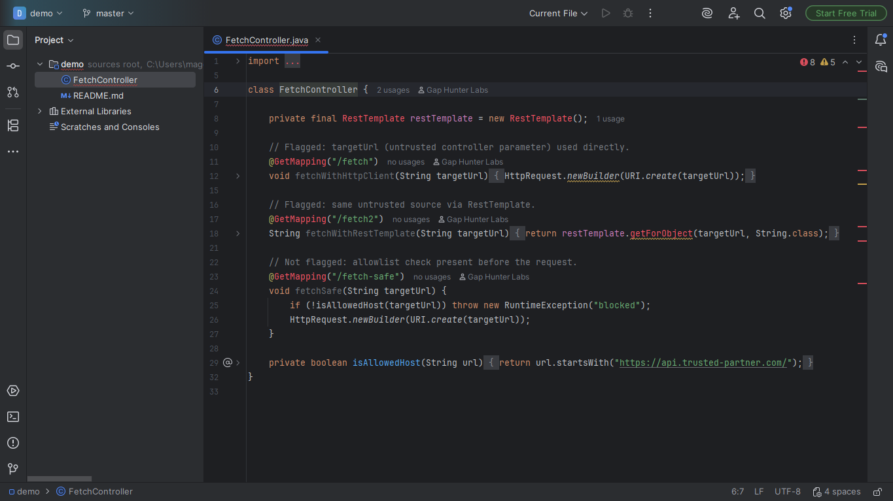
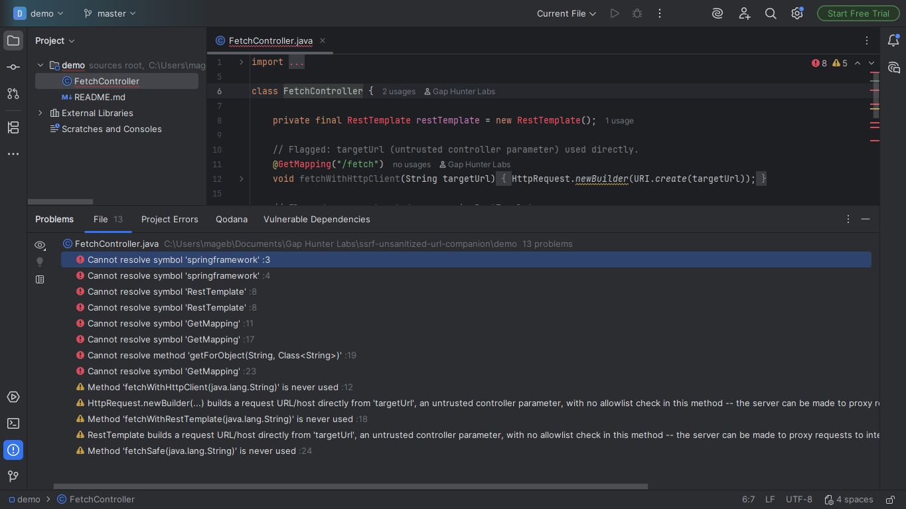

# SSRF via Unsanitized URL Companion

Warning on an HTTP call (`HttpRequest.newBuilder(...)`/Spring
`RestTemplate`/OkHttp's `Request.Builder`) whose URL/host argument
traces back (within the same method, one direct hop) to an untrusted
Spring MVC/JAX-RS controller parameter, with no allowlist validation
found in the same method -- CWE-918, Server-Side Request Forgery.

## Screenshots





## Why it exists

An attacker uses the server itself as a proxy toward internal
resources -- cloud metadata endpoints, internal services with no
perimeter authentication. This category has a dedicated CodeQL query
and a dedicated AWS CodeGuru Detector Library detector; no Marketplace
plugin found doing it as an inline IDE inspection.

## Why built this way

Same source-to-sink flow-following mechanism as
`unsafe-deserialization-sink-companion` (this catalog), applied to a
different sink category:

- The untrusted source is a closed list of known Spring MVC/JAX-RS
  controller signatures.
- The sink is a closed list of known HTTP client APIs
  (`java.net.http.HttpClient`, `RestTemplate`, OkHttp).
- A method that already contains a recognizable allowlist check
  (`isAllowedHost`, `allowlist`, `whitelist`, etc.) is never flagged --
  a cosmetic check doesn't count, but this plugin can't tell a real
  allowlist from a fake one by name alone; that's a documented limit,
  not a claim of perfect precision.

## v0.1 scope — stated honestly, not exhaustively

Only follows the data within the SAME method and a direct one-hop
reference to a parameter -- never crosses more than one method of
distance, no general taint analysis of the whole project.

## Usage

Open any Java file with a Spring MVC/JAX-RS endpoint method. An HTTP
call whose URL/host argument traces back to an untrusted parameter
(with no allowlist check in the same method) shows a warning on the
call.

## Enterprise / Team Licensing

Need enterprise features, custom rules, or team licensing? Contact us at
**gaphunterlabs@gmail.com**.

## Development

```
./gradlew test           # unit tests
./gradlew buildPlugin    # generates build/distributions/*.zip
./gradlew verifyPlugin   # checks compatibility against real IDEs
```

## License

Apache-2.0. See `LICENSE`.
